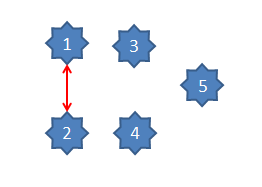
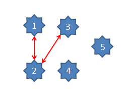
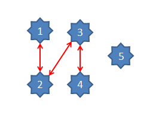
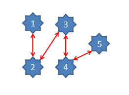
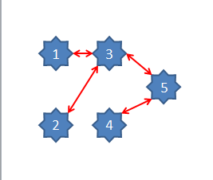
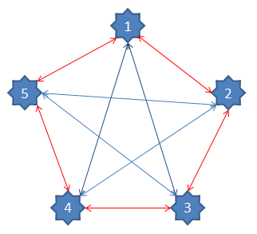
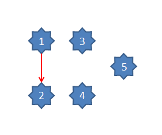
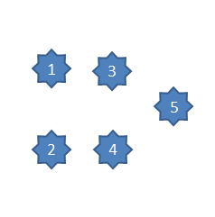

---
output:
  xaringan::moon_reader:
    css: ["zh-CN.css", "extra.css"]
    lib_dir: libs
    chakra: libs/remark-latest.min.js
    nature:
      highlightStyle: github
      highlightLines: true
      countIncrementalSlides: false
---
background-image: url(./images/tk_Heading.png)
background-position: 50% 50%
class: top, left,
company: 不公开资料
author: 胡立磊

### KnowledgeSpace在知识管理中的应用

--

<br/>
<br/>
<br/>
<br/>

## .red[{{company}}]


--
<br/>
<br/>
<br/>
<br/>
<br/>
### {{author}}       `r Sys.Date()`
---
name: KDW
layout: false
background-image: url(./images/tk_Title.png)
background-position: 50% 50%
class: left, top, 


---
layout: true


--

## .matureBlue[知识空间的静态描述]

--

## .golden[知识空间的动态描述]

--

## .lightRed[知识空间建模型]

--

# .lightRed[模型的应用]

---
name: KDB
layout: true
background-image: url(./images/tk_Body.png)
background-position: 50% 50%
class: left, top,
---
#基础概念

###知识空间KnowledgeSpace

注：知识空间用于描述一个知识领域或一门课程，它是知识点的集合。

###知识点KnowledgePoint

   它是某个知识空间中的基础要素，它可以是概念或操作说明

###知识通路KnowledgeRoad
   两个知识点之间的双向连接的，如kp1 <--> kp2。
   
注：上述更加通俗的说法就是空间、点、线


---

假设一个知识空间KS由N=5个知识点KPs组成,简单KS{N=5}。

他们分别是`r paste('kp',1:5,sep='') `

如果**`r length(1:5)`**个知识点之间的相互关系 可以使用矩阵KSDM(knowledge space description matrix)进行描述；

这是一个`N*N`的二维矩阵。

---
##KP1连接KP2(1 of 4)
下面我们继续 kp1 <--> kp2;
.pull-left2[
```{r echo=TRUE, fig.height=5, fig.width=5}
   #R语言的代码如下
   kp <-paste('kp',1:5,sep='');
   ks <-matrix(rep(0,5^2),nrow=5,
               dimnames = list(kp,kp));
   #注意如下2个点设置为1
   ks[1,2] <- 1; 
   ks[2,1] <- 1; 
   ks;
```
]

.pull-right2[


]

---
--- 
##KP2连接KP3(2 of 4)
下面我们继续 kp2 <--> kp3;
.pull-left2[
```{r echo=TRUE, fig.height=5, fig.width=5}
   kp <-paste('kp',1:5,sep='');
   ks <-matrix(rep(0,25),nrow=5,
   dimnames = list(kp,kp));
   ks[1,2] <- 1; 
   ks[2,1] <- 1; 
   ks[2,3] <- 1;
   ks[3,2] <- 1;
   ks;
```
]
.pull-right2[


]

---
#处理说明
下面我们继续 kp3 <--> kp4;

.pull-left[


]
.pull-right[
```{r echo=FALSE, fig.height=5, fig.width=5}
  kp <-paste('kp',1:5,sep='');
   ks <-matrix(rep(0,25),nrow=5,dimnames = list(
     kp,kp
   ));
   ks[1,2] <- 1; 
   ks[2,1] <- 1; 
   ks[2,3] <- 1;
   ks[3,2] <- 1;
   ks[3,4] <- 1;
   ks[4,3] <- 1;
   ks;
```
]

---
#处理说明
下面我们继续 kp4 <--> kp5;

.pull-left[


]
.pull-right[
```{r echo=FALSE, fig.height=5, fig.width=5}
  kp <-paste('kp',1:5,sep='');
   ks <-matrix(rep(0,25),nrow=5,dimnames = list(
     kp,kp
   ));
   ks[1,2] <- 1; 
   ks[2,1] <- 1; 
   ks[2,3] <- 1;
   ks[3,2] <- 1;
   ks[3,4] <- 1;
   ks[4,3] <- 1;
   ks[4,5] <- 1;
   ks[5,4] <- 1;
   ks;
```
]

注：在上图中，我们看到形成了一条完整的路径，连接所有的知识点，我们把能够连接所有知识点的通路称为
通知路径knowledgeWay,简称KW

---
#处理说明
 一个知识空间的知识路径往来不止一条，我们来看一下另外一条KW

.pull-left[


]
.pull-right[
```{r echo=FALSE, fig.height=5, fig.width=5}
  kp <-paste('kp',1:5,sep='');
   ks <-matrix(rep(0,25),nrow=5,dimnames = list(
     kp,kp
   ));
   ks[1,3] <- 1; 
   ks[3,1] <- 1; 
   ks[2,3] <- 1;
   ks[3,2] <- 1;
   ks[3,5] <- 1;
   ks[5,3] <- 1;
   ks[4,5] <- 1;
   ks[5,4] <- 1;
   ks;
```
]
---
#全通的知识的空间的表达


.pull-left[


]
.pull-right[
```{r echo=FALSE, fig.height=5, fig.width=5}
  kp <-paste('kp',1:5,sep='');
  ks <-matrix(rep(1,25),nrow=5,dimnames = list(
     kp,kp
   ));
  ks[1,1] <- 0;
  ks[2,2] <- 0;
  ks[3,3] <- 0;
  ks[4,4] <- 0;
  ks[5,5] <- 0;
  ks;
```
]
---


---
# 知识右路的示例

####知识右路（from left to right）
   从小序号知识点沿从左向右方向走向大序号知识，
   如kp1 --> kp2; 

.pull-left[



]

.pull-right[

```{r echo=FALSE, fig.height=5, fig.width=5}
  kp <-paste('kp',1:5,sep='');
  ks <-matrix(rep(0,25),nrow=5,dimnames = list(
     kp,kp
   ));
  ks[1,2] <- 1;
  ks;
```
]

---
# 知识左路的示例

####知识左路（from left to right）
   从大序号知识点沿从右向左方向走向小序号知识，
   如kp1 <-- kp2; 

.pull-left[


]

.pull-right[

```{r echo=FALSE, fig.height=5, fig.width=5}
  kp <-paste('kp',1:5,sep='');
  ks <-matrix(rep(0,25),nrow=5,dimnames = list(
     kp,kp
   ));
  ks[2,1] <- 1;
  ks;
```
]


---
####知识封路(freeze in the middle)
   任意两个知识点之间没有通路, 如kp1 -><- kp2
.pull-left[

]
.pull-right[
```{r echo=FALSE, fig.height=5, fig.width=5}
   kp <-paste('kp',1:5,sep='');
   ks <-matrix(rep(0,25),nrow=5,dimnames = list(
     kp,kp
   ))
   ks;
```
]

---
#结论:

1. KSDM是用于描述知识空间的有利工具

1. 在知识通路的双向的前提下KSDM是对称矩阵；

1. 在知识右路，知识左路的前提下是非对称称，带有方向性

1. 在全通路的情况下，KSDM为主对角线为0，其他位置为1的矩阵

1. 一个KS可以多条KW;

1. 实际应用过程中KSDM是知识通路，右路，左路，封路的综合体。

1. 上述的矩阵阵列可以使用数据库进行存储
  采用from,to,value3列字段进行存储；
  


---

##在静态描述中的相关知识

--

###计算知识点路径数getRoadCount

思路：计算出KSDM中1的数量

--

###计算路径getKnowledgeWays

思路：计算出首尾相连的路径，只到可以通向最后一个节点。

--

###计算知识点层数getLevelCount

思路：在getKnowledgeWays上基础上计算出KP的数量

---
#知识空间的动态描述
--

###增加节点appendKP

--

###插入节点insertKP

--

###删除节点delKP

--

###设置全通路径setFullRoad

--

###设置右路setRightRoad

--

###设置左路setLeftRoad

--

###设置封路setNullRoad

---
# 张量在到达描述中的应用；

假设原来的张量为KS{N=10};
所有的KP之间都是全通双向的
在保持节点不变的情况下，每增长一个通道我们使用版本来表达；
这样就会形成一个3阶张量，准确地张是10*10*V; 
V>=1,且不断增加；
这也是一个半对称的张量。
用于描述知识库之间的构建过程。

---
#知识空间的学习应用
学习状态描述
如果已经掌握的知识使用1表示，没有掌握的知识使用0表示
某个时间的知识状态就是一个向量
```{r echo=FALSE}
   kp <-paste('kp',1:5,sep='');
   ls <- c(0,0,0,0,0);
   names(ls) <- kp;
   ls
```
---
如果是多天的学习状态可以做成做成一个一个矩阵；
```r
    kp <-paste('kp',1:5,sep='');
    days <-paste('d',1:31,sep="");
    status <-c(ls1,ls2,ls3,ls4,....l31);
    data <- matrix(status,nrow=31,dimnames=list(days,kp));
    data;
```


 
---
   多人多天的学习状态记录
   
   按上述作为基础的3阶的张量
   
      状态* 天数* XX人
   
   
---

学习进度的评估

相领多少天学习进度相同，说明“停滞不前”，

需要进行提醒。

思路：相同状态使用的天数差异；

---

学习效果的评估

就是相同时间比获取知识点的多少或总积分的多少；


## 线性模型

路线基本一致：达到指定点所使用的时间
相当于指定路径

如果是线下，可能某个节点的缺失，就会导致断网。

要求是升级打怪，一级一级进行处理；LeVEL更多；

   

## 网络模型

通过选择不同的路径来达到知识点最大化；
路径自由选择

如果是网络，网络的稳定性如何；

这也是许多人语言不会差的原因

注：网络好了带来了随机时，条条大道通罗马；


---
#KS的应用

##KS在数学上的应用

##KS在ERP上的应用

##KS在语文上的应用

---
记得以老师现场板书，

然后有了幻灯片（手写）

然后有了PPT

是否可以有了知识库？?
---

方法上优化的建议


---
layout: false
name: KDTHX
background-image: url(./images/tk_Thankyou.png)
background-position: 20% 50%


